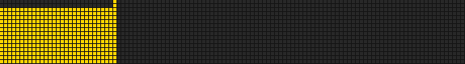

<div align="center">
  

  <h1>Flipdot for Home Assistant</h1>
  <p><strong>A full Home Assistant integration for <a href="https://github.com/Fluepke/fluepdot">fluepdot</a> flip-dot displays</strong></p>

  <p>
    <a href="https://github.com/hacs/integration"></a>
    <a href="https://github.com/Subnet-Zero/fluepdot-ha/actions/workflows/hacs.yaml"></a>
    <a href="https://github.com/Subnet-Zero/fluepdot-ha/actions/workflows/hassfest.yaml"></a>
    <a href="LICENSE"></a>
  </p>
</div>

---

`fluepdot` hangs a real, mechanical [flip-dot display](https://github.com/Fluepke/fluepdot) — the
kind of clattering dot-matrix panel that used to sit above bus doors — directly off Home
Assistant. Not "one switch that sends a string": a device, entities, live preview, a priority
queue, quiet hours, and fifteen actions to draw text, bars, icons, marquees, destination signs, water
and raw frames on it.

<div align="center">
  
  <br>
  <sub>The <code>image.flipdot_preview</code> entity mirrors whatever is physically flipped on the board right now.</sub>
</div>

## Before you read on: how this came to be

This integration was written almost entirely by an AI (Claude, via Claude Code) for my own
flip-dot display at home. I described what I wanted, reviewed the result, tested it against the
real hardware, and pushed it. I'm not a Home Assistant integration developer, and I won't
pretend otherwise.

It works well for me — the whole thing has been exercised live against a real fluepboard,
including the priority queue, quiet hours, font extraction and the render pipeline. If it's
useful to you too, great, help yourself. If you find a bug or it doesn't work with your setup,
please [open an issue](https://github.com/Subnet-Zero/fluepdot-ha/issues) — I'll look at it when
I can, but there's no support contract behind this, and pull requests are very welcome if you'd
rather fix it yourself.

## What you need

- A **fluepdot** flip-dot display: the [fluepboard](https://fluepdot.readthedocs.io/) controller
  (ESP32-based) driving one or more flip-dot panels, running the stock
  [fluepdot firmware](https://github.com/Fluepke/fluepdot). This integration talks to the
  firmware's built-in HTTP API — it does not replace or modify the firmware.
- The board reachable over HTTP from your Home Assistant instance (same LAN/VLAN). The firmware
  has **no authentication**, so keep it on a network segment you trust.
- Home Assistant **2024.6** or newer. Developed and tested against 2026.8.

## Installation

### Via HACS (recommended)

This integration isn't in the default HACS catalog, so add it as a custom repository:

1. HACS → the **⋮** menu (top right) → **Custom repositories**.
2. Repository: `https://github.com/Subnet-Zero/fluepdot-ha`, category: **Integration**.
3. Find **Flipdot (fluepdot)** in HACS and install it.
4. Restart Home Assistant.

### Manually

Copy `custom_components/fluepdot` from this repository into your Home Assistant `config/custom_components/` folder, then restart Home Assistant.

## Setup

**Settings → Devices & Services → Add Integration → "Flipdot"**, then enter the board's host or
IP address (e.g. `10.0.0.164`). Home Assistant confirms the connection by reading the current
framebuffer, which also tells it the display's actual size — nothing to configure by hand.

## What you get

One device, 26 entities:

| Entity | What it does |
|---|---|
| `image.flipdot_preview` | Live PNG snapshot of whatever is currently on the board |
| `text.flipdot_message` | Free-text field — whatever you type gets shown |
| `select.flipdot_mode` | `rotation` · `date` · `manual` · `off` |
| `select.flipdot_fluid_simulation` / `button.flipdot_play_fluid_simulation` | Pick a water simulation — picking one plays it right away; the button plays it again |
| `select.flipdot_font` / `select.flipdot_alignment` | Default font and text alignment |
| `switch.flipdot_display` | Display on/off (off = blank, and stops writing anything) |
| `switch.flipdot_quiet_hours` | Enable/disable the quiet-hours gate |
| `time.flipdot_quiet_hours_start` / `time.flipdot_quiet_hours_end` | Quiet hours as entities — editable from the dashboard or an automation |
| `switch.flipdot_differential_rendering` | Toggle the firmware's differential draw mode |
| `number.flipdot_rotation_interval` / `number.flipdot_set_delay` | Seconds per rotation page · per-column drive timing |
| `sensor.flipdot_content` | What's showing right now, with source, priority, expiry and counters as attributes |
| `sensor.flipdot_pixels_on` / `sensor.flipdot_page` | Diagnostics |
| `binary_sensor.flipdot_online` / `binary_sensor.flipdot_foreign_content` / `binary_sensor.flipdot_quiet_hours` | Connectivity · someone else wrote to the board · quiet hours active |
| `button.flipdot_clear` / `button.flipdot_date` / `button.flipdot_test_pattern` / `button.flipdot_invert` / `button.flipdot_exercise_pixels` | One-shot actions, including a pixel-exercise routine against stuck dots |
| `notify.flipdot_notification` | The board as a regular notification target (`notify.send_message`) |

### Actions

`fluepdot.send_text` · `send_lines` · `marquee` · `destination_sign` · `draw` · `draw_bar` ·
`set_pixel` · `clear_pixel` · `clear` · `effect` (wipe / dissolve / matrix / blink / snow /
invert) · `fluid` · `show_page` · `reload_pages` · `extract_fonts` · `set_rendering_timings` — all with UI
selectors, so they're usable straight from the Developer Tools → Actions tab without writing YAML.

Two render paths, picked automatically or explicitly via `mode`:

- **`device`** — the board renders its own built-in fonts, exactly like calling its HTTP API
  directly. Fast, matches the firmware's native look.
- **`compose`** — Home Assistant builds the full 115×16 (or whatever your panel size is) frame
  in Python and sends it in one shot. This is what makes centering, multi-line text, icons, bars
  and word wrap possible — the firmware's own renderer can't do any of that.

Anything with `align` other than left automatically upgrades to `compose`, since the firmware
has no concept of alignment on its own.

### Destination signs

`fluepdot.destination_sign` makes the board do the one job these panels were built for: the
line number in a box on the left, the destination beside it, and the stop it runs via smaller
underneath.

```yaml
action: fluepdot.destination_sign
data:
  line_number: M29
  destination: Hauptbahnhof
  via: Rathaus
  duration: 60
```

`box` picks the style — `outline` (default, a frame around the number), `filled` (the number
punched out of a solid block) or `none`. The via line uses `builtin3x5`, a 3×5 bitmap font that
ships with the integration so the second line is legible on a 16-row panel without running
`extract_fonts` first; it is capitals-only, because five rows leave no room for descenders.
A destination too wide for the remaining space drops to the small font and is truncated after
that — or set `scroll: true` to let destination and via run through while the box stays put,
the way a real vehicle does it.

`scripts/preview_sign.py` renders the same layouts without Home Assistant and prints them as
ASCII you can paste straight into `fluepdot.draw`, which is handy for checking a change against
the real board before deploying it.

### Fluid simulations

`fluepdot.fluid` (or the `select.flipdot_fluid_simulation` dropdown) pours water across the
board. Each simulation is a small story that ends with an empty board again:

<div align="center">
  
</div>

| Simulation | What happens |
|---|---|
| `pour` | Someone tips a jug in — a wobbly stream, splashes, the level rises, then the floor opens |
| `wave` | Waves roll in, steepen into breakers, slam into the walls and throw spray |
| `rain` | Rain falls into a puddle: a few drops, a shower, then it eases off |
| `dam_break` | A column of water behind a dam — the dam goes, a tongue of water shoots across and bounces back |
| `slosh` | A glass of water tipped back and forth until it sloshes over the rim |
| `drain` | A full tub, someone pulls the plug — a funnel forms around the drain |
| `fountain` | A pulsing fountain in a basin; the water goes round in circles |
| `ripple` | Top view of a pond: drops fall in and the rings overlap |
| `surprise` | One of the above, picked at random |

```yaml
action: fluepdot.fluid
data:
  simulation: dam_break
  duration: 30   # the whole story always plays; shorter = faster
  delay: 0.2     # seconds per frame
  text: HALLO    # optional
```

`text` stays readable inside the water (inverted) and is left standing at the end; with `drain`
the letters are solid, so water gets caught in them. `seed` makes a run repeatable. The water is
real physics, just coarse: the waves are the 1D shallow-water equations (which is why they
steepen into breakers on their own), the drops are ballistic, and `drain` is a cellular
automaton. Everything is computed in Python up front, in the executor, in well under a second.

Flip dots are mechanical, so a frame every 0.2 s is about as fast as it gets; turning on
`switch.flipdot_differential_rendering` makes the animation noticeably smoother because only
the dots that change are flipped. `scripts/preview_fluid.py` plays all simulations as ASCII in
the terminal and can write animated GIFs (`--gif out/`) — no Home Assistant required.

### Rotation pages: `fluepdot_pages.yaml`

On first start the integration writes `fluepdot_pages.yaml` into your Home Assistant config
directory, with one active page (today's date) and a handful of disabled examples (clock,
next trash pickup, weather, PV power with a bar, "laundry done"). Each page is a small block of
Jinja templates:

```yaml
pages:
  - id: date
    name: Date
    enabled: true
    duration: 60
    mode: device
    font: DejaVuSans12bw_bwfont
    text: >
      {{ now().strftime('%a, %d %B') }}

  - id: weather
    name: Weather
    enabled: false
    duration: 30
    mode: compose
    align: center
    lines:
      - "{{ state_attr('weather.home','temperature') | round(0) }}°"
      - "{{ states('weather.home') }}"
```

A page can also be a destination sign, with the same three parts as the action:

```yaml
  - id: bus
    name: Next bus
    enabled: false
    duration: 30
    sign:
      line_number: "{{ states('sensor.bus_line') }}"
      destination: "{{ states('sensor.bus_destination') }}"
      via: "{{ states('sensor.bus_via') }}"
```

Edit the file, then call `fluepdot.reload_pages` — no restart needed. A page can carry a Jinja
`condition` (only shown when true), an `icon`, and a `bar` block for a progress bar.

### Priority and quiet hours

Four levels — `background` (rotation) < `normal` < `high` < `alarm`. A message at a given
priority can only be replaced by one of equal or higher priority; once its `duration` runs out,
the display falls back to rotation on its own.

Quiet hours are **hard**: between `time.flipdot_quiet_hours_start` and `time.flipdot_quiet_hours_end`, nothing gets written
at all — not even `alarm` priority — and suppressed messages are dropped rather than queued up
for when quiet hours end. A flip-dot display is audible, and 6:30 AM is not the time to replay
everything that happened overnight.

## Known quirks (of the firmware, not this integration)

- **`POST /pixel` doesn't actually flip a dot**, even though the firmware answers with HTTP 200
  and `GET /pixel` reports the new value. `fluepdot.set_pixel` / `clear_pixel` work around this
  by rewriting the whole framebuffer instead of poking a single coordinate.
- There's **no authentication** and no endpoint to clear the whole display in one call — this
  integration is the only thing that should be writing to the board if you want predictable
  behavior. `binary_sensor.flipdot_foreign_content` flags it when something else writes anyway.
- `fluepdot.extract_fonts` measures the firmware's built-in fonts by rendering every character
  once and reading the frame back. It clatters for several minutes, so it never runs on its
  own — only when you call it.

## Contributing

Issues and pull requests are welcome — for a bug report, the board's firmware version and
whatever's in `sensor.flipdot_content`'s attributes at the time usually helps. This project doesn't
come with a roadmap; it does what my own display needed.

## License

[MIT](LICENSE) — do what you like with it.
